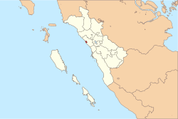

<!DOCTYPE html>
<html>
<head>
<meta name="viewport" content="width=device-width, initial-scale=1">
 	<title>Kota Pariaman</title>
   	<link rel="stylesheet" href="assets/styles/style.css">
</head>
<body>
	<header>
	

               <h1>Pariaman</h1>
               
Kota Pariaman adalah sebuah kota yang terletak di provinsi Sumatra Barat, Indonesia. Kota ini berjarak sekitar 56 km dari kota Padang atau 25 km dari Bandara Internasional Minangkabau.

               

	<nav>
                      <ul>
 		<li><a href="#sejarah">Sejarah</a></li>
                <li><a href="#geografis">Geografis</a></li>
                <li><a href="#pemerintahan">Pemerintahan</a></li>
		<li><a href="#penduduk">Penduduk</a></li>
		<li><a href="#pendidikan">Pendidikan</a></li>
		<li><a href="#kesehatan">Kesehatan</a></li>
		<li><a href="#perhubungan">Perhubungan</a></li>
		<li><a href="#ekonomi">Ekonomi</a></li>
		<li><a href="#pariwisata">Pariwisata</a></li>
		<li><a href="#budaya">Budaya</a></li>
                      </ul>
	</nav>
	</header>
	<main>
		

			<article id="sejarah" >
     				<h2 id="sejarah" class="card">Sejarah</h2>
     				
				
Menurut laporan Tomé Pires dalam Suma Oriental yang ditulis antara tahun 1513 and 1515, kota Pariaman ini merupakan bagian dari kawasan rantau Minangkabau. Dan kawasan ini telah menjadi salah satu kota pelabuhan penting di pantai barat Sumatra. Pedagang-pedagang India dan Eropa datang dan berdagang emas, lada dan berbagai hasil perkebunan dari pedalaman Minangkabau lainnya. Namun pada awal abad ke-17, kawasan ini telah berada dalam kedaulatan kesultanan Aceh.

		

				
Seiring dengan kedatangan Vereenigde Oostindische Compagnie (VOC) pada tahun 1663 yang kemudian mendirikan kantor dagang di kota Padang yang kemudian pada tahun 1668 berhasil mengusir pengaruh kesultanan Aceh di sepanjang pesisir pantai barat Sumatra, mulai dari Barus sampai ke Kotawan. Dan kemudian pemerintah Hindia Belanda memusatkan aktivitasnya di kota Padang, dan membangun jalur rel kereta api antara kota Padang dengan kota Pariaman, sehingga lambat laun pelabuhan Pariaman pun mulai kehilangan pamornya.

 			</article>
 			<article id="geografis">
     				<h2 id="geografis" class="card">Geografis</h2>
     				
				
Kota Pariaman merupakan hamparan dataran rendah yang landai terletak di pantai barat Sumatra dengan ketinggian antara 2 sampai dengan 35 meter di atas permukaan laut dengan luas daratan 73,36 km² dengan panjang pantai ± 12,7 km serta luas perairan laut 282,69 km² dengan 6 buah pulau-pulau kecil di antaranya Pulau Bando, Pulau Gosong, Pulau Ujung, Pulau Tangah, Pulau Angso dan Pulau Kasiak.

				
Kota Pariaman merupakan daerah yang beriklim tropis basah yang sangat dipengaruhi oleh angin barat dan memiliki bulan kering yang sangat pendek. Curah hujan pertahun mencapai angka sekitar 4.055 mm (2006) dengan lama hari hujan 198 hari. Suhu rata-rata 25,34 °C dengan kelembaban udara rata-rata 85,25 dan kecepatan angin rata-rata 1,80 km/jam.

 				
				
<h2>Batas Wilayah</h2>
				<table style="width:100%">
  					<tr>
    					<th>Utara</th>
    					<td>Kecamatan V Koto Kampung Dalam, kabupaten Padang Pariaman</td>
  					</tr>
  					<tr>
    					<th>Timur</th>
    					<td>Kecamatan VII Koto Sungai Sarik, kabupaten Padang Pariaman</td>
  					</tr>
  					<tr>
    					<th>Selatan</th>
    					<td>Kecamatan Nan Sabaris, kabupaten Padang Pariaman</td>
  					</tr>
  					<tr>
    					<th>Barat</th>
    					<td>Samudera Hindia</td>
  					</tr>
				</table>

			</article>
 			
			<article id="pemerintahan">
			<h2 id="pemerintahan" class="card">Pemerintahan</h2>
			
			
Kota Pariaman diresmikan sebagai kota otonom oleh Menteri Dalam Negeri, Hari Sabarno pada tanggal 2 Juli 2002 berdasarkan Undang-undang Nomor 12 Tahun 2002 tentang pembentukan kota Pariaman di Provinsi Sumatra Barat. Sebelumnya kota ini berstatus kota administratif dan menjadi bagian dari kabupaten Padang Pariaman berdasarkan Peraturan pemerintah Nomor 33 Tahun 1986 yang diresmikan tanggal 29 Oktober 1987 oleh Mendagri Soepardjo Rustam dengan Wali kota pertamanya Drs. Adlis Legan (1987-1993).

				<section>
				<h3>Kecamatan</h3>
				<table style="width:100%">
  					<tr>
    					<th>Pariaman Selatan</th>
    					</tr>
  					<tr>
    					<th>Pariaman Tengah</th>
    					</tr>
  					<tr>
    					<th>Pariaman Timur</th>
    					</tr>
  					<tr>
    					<th>Pariaman Utara</th>
    					</tr>
				</table>
				
				
Kota Pariaman memiliki 71 (tujuh puluh satu) Kelurahan/Desa yang tergabung dalam 12 (dua belas) Kenagarian.

				
Sampai tahun 2008 tercatat 2.952 orang pegawai negeri sipil (PNS) yang bekerja di lingkungan pemerintah kota Pariaman, dengan rincian 54 orang berpendidikan Pasca Sarjana, 1.049 orang Sarjana, 761 orang dengan pendidikan Diploma III, 319 orang D II, 510 orang dengan pendidikan SLTA, 24 orang lulusan SLTP dan 16 orang lulusan SD

				</section>
			</article>
			
			<article id="penduduk">
			<h2 id="penduduk" class="card">Penduduk</h2>
			
Kota Pariaman jumlah penduduknya hampir secara keseluruhan didominasi oleh etnis Minangkabau, dengan rasio jenis kelamin 93.26, sedangkan jumlah angkatan kerja 27.605 orang dengan jumlah pengangguran 2.970 orang. Dan pada kecamatan Pariaman Tengah menjadi kawasan yang paling padat jumlah penduduknya.

			</article>

			<article id="pendidikan">
			<h2 id="pendidikan" class="card">Pendidikan</h2>
			
Pendidikan merupakan faktor penting dalam pembangunan daerah dan menjadi salah satu prioritas pemerintah kota ini, karena dengan ketersediaan sumberdaya manusia yang berkualitas tentu akan mendorong perkembangan pembangunan kota Pariaman. Beberapa program pemerintah kota diarahkan pada peningkatan sarana prasarana penunjang pendidikan, baik pengadaan alat laboratorium, alat peraga sekolah, maupun buku-buku sekolah. Selain itu peningkatan kemampuan dan pemerataan tenaga pendidik juga dilakukan secara kontinu termasuk dukungan pendanaan, pelatihan maupun studi lanjut.

			</article>
	
			<article id="kesehatan">
			<h2 id="kesehatan" class="card">Kesehatan</h2>
			
Di Kota Pariaman terdapat 2 (dua) Rumah Sakit Umum Daerah (RSUD) yakni RSUD Pariaman milik Pemerintah Provinsi Sumatra Barat yang terletak di Jalan M. Yamin, Kampung Baru, Kecamatan Pariaman Tengah dengan klasifikasi RS tipe B dan RSUD dr Sadikin milik Pemerintah Kota Pariaman yang terletak di Jalan Gandoriah, Kampung Gadang, Kecamatan Pariaman Timur dengan klasifikasi RS tipe D. Disamping itu juga terdapat Rumah Sakit milik Swasta diantaranya RS Asyiyah, RS Tamar Medical Center dan 18 Klinik/Balai Pengobatan. Kota ini juga memiliki 7 puskesmas, 13 puskesmas pembantu, 51 pos kesehatan desa/kelurahan (Poskesdes/Poskeslur).

			</article>
			
			<article id="perhubungan">
			<h2 id="perhubungan" class="card">Perhubungan</h2>
			
			
Sebelumnya pelabuhan di kota Pariaman pernah menjadi pusat perdagangan di pantai barat pulau Sumatra, namun seiring dengan menguatnya kekuasaan pemerintahan kolonialis Hindia Belanda, lambat laun peranan pelabuhan kota ini menurun digantikan oleh pelabuhan Muara dan pelabuhan Teluk Bayur yang terletak di kota Padang. Sampai saat ini pelabuhan laut di kota ini masih belum berfungsi sebagai sarana angkutan penumpang dan barang, dan hanya digunakan untuk tempat berlabuh kapal-kapal nelayan setempat.

			
Pembangunan jalan merupakan aspek penting dalam menunjang sektor ekonomi dan sosial sehingga dapat mengakomodasi keterhubungan lokasi atau ruang fisik di mana kegiatan penduduk berada. Sampai tahun 2007 pemerintah kota Pariaman telah melakukan peningkatan jalan sepanjang 78.30 km.

			
Selanjutnya sebagai sarana transportasi untuk angkutan dalam kota dan sekitarnya, terdapat angkutan kota (angkot), angkutan desa (angdes) dan bendi (kereta kuda). Sedangkan untuk antar kota dalam provinsi dan antar kota antar provinsi digunakan bus dan sebagai pusat dari sarana angkutan darat di kota ini adalah Terminal Jati di Jalan RW Mongonsidi, Jati Mudik, Kecamatan Pariaman Tengah yang merupakan Terminal Bus tipe A yang dikelola oleh Satuan Pelaksana (Satpel) Direktorat Jenderal Perhubungan Darat, Kementerian Perhubungan RI.
	
			
Selain itu kota ini juga memiliki sarana transportasi kereta api reguler (KA SIbinuang) dengan jadwal 4 kali sehari PP yang dioperatori oleh PT. KAI DIvre II Sumatra Barat yang menghubungkan kota ini dengan kota Padang. KA Sibinuang melintasi Stasiun Pariaman dan Stasiun Kuraitaji. Rencananya setelah proyek revitalisasi Balai Teknik Perkeretaapian Sumatra Bagian Barat (BTPSBB) Kemenhub selesai jalur KA Sibinuang akan diteruskan hingga ke Stasiun Naras.
	
			</article>
			
			<article id="ekonomi">
			<h2 id="ekonomi" class="card">Ekonomi</h2>
			
Sektor perdagangan merupakan sektor yang menyerap tenaga kerja paling banyak di kota Pariaman, yang kemudian disusul oleh sektor jasa, di mana pada kota ini terdapat 2 (dua) unit pasar induk tradisional yakni Pasar Pariaman dan Pasar Kuraitaji serta pasar pembantu yakni Pasar Pagi Nareh, Pasar Cubadak Aia dan Pasar Cubadak Mentawai. Sektor industri cukup berkembang di kota ini terutama industri kimia dan logam. Sedangkan sektor pertanian masih menjanjikan bagi masyarakat setempat di mana sampai tahun 2007 luas areal persawahan yang masih dimiliki kota ini adalah 36.81 % dari total luas wilayahnya, dan sektor pertanian ini juga memberikan konstribusi paling besar yaitu sebesar 27.06 % dari total PDRB kota Pariaman.

			</article>	

			<article id="pariwisata">
     			<h2 id="pariwisata" class="card">Pariwisata</h2>
			
			
Kota Pariaman fokus membenahi dan mengembangkan sektor pariwisata bahari secara berkesinambungan karena memiliki pantai landai dengan pesona yang indah. Objek wisata pantai Pariaman di antaranya yang paling terkenal adalah pantai Gandoriah yang berlokasi di depan stasiun kereta api Pariaman yang dilengkapi dengan sarana prasarana seperti Anjungan, Pujasera, Plaza Gandoriah, Dermaga Apung, Monumen Perjuangan TNI AL, Gandoriah Bridge dan Jembatan Muaro. Pantai Kata dengan Taman Kota (Ex. Astaka MTQ Nasional Provinsi), Air Mancur menari, Anjungan, Resort dan Monumen Ikan di Karan Aua-Taluak, Pantai Pasir Lohong dengan Taman Anas Malik dan Taman Pemuda Asean (Asean Young Park) di Lohong, Pantai Cermin 
			di Karan Aua, Rawa Mati di Mangguang, Pantai Belibis di Nareh dan memiliki Hutan bakau serta Pusat Penangkaran Penyu pertama di Sumatra Barat di Pantai Penyu, Apa, Kec. Pariaman Utara. Selain itu Kota yang bermotto Sabiduak Sadayuang ini juga memiliki 6 (enam) pulau kecil yang tak berpenghuni yang terus dikembangkan sarana dan prasarananya sebagai destinasi wisata oleh Pemerintah Kota setempat di antaranya Pulau Angso Duo, Pulau Bando, Pulau Gosong, Pulau Ujuang, Pulau Tangah dan Pulau Kasiak.

			
Kota ini juga dikenal dengan pesta budaya tahunan tabuik yang prosesi acaranya diselenggarakan mulai dari tanggal 1 Muharam sampai pada puncaknya tanggal 10 Muharam setiap tahunnya. Saat ini terdapat 2 museum rumah Tabuik yakni Rumah Tabuik Subarang di Jl. Imam Bonjol, Cimparuah Samping Balai Kota dan Rumah Tabuik Pasa di Jl. Syekh Burhanuddin, Karan Aua yang memuat informasi sejarah perkembangan dan pembuatan tabuik beserta replikanya.

			</article>
 			<article id="budaya">
     			<h2 id="budaya" class="card">Budaya</h2>
			
Masyarakat di kota Pariaman ini memiliki keunikan tersendiri dibandingkan etnis Minangkabau umumnya. Sebagai kawasan yang berada dalam struktur rantau, beberapa pengaruh terutama dari Aceh masih dapat ditelusuri sampai sekarang, di antaranya penamaan atau panggilan untuk seseorang di kawasan ini, misalnya ajo (lelaki dewasa, dengan maksud sama dengan kakak) atau cik uniang (perempuan dewasa, dengan maksud sama dengan kakak) sedangkan panggilan yang biasa digunakan di kawasan darek adalah uda (lelaki) dan uni (perempuan). Selain itu masih terdapat lagi beberapa panggilan yang hanya dikenal di kota ini seperti bagindo, sutan atau sidi (sebuah panggilan kehormatan buat seseorang yang telah menikah dirumah mertuanya tapi tidak dirumah orang tua kandungnya).

			
Kemudian dalam tradisi perkawinan, masyarakat pada kota ini masih mengenal apa yang dinamakan Ba japuik yaitu semacam tradisi di mana pihak mempelai wanita mesti menyediakan uang dengan jumlah tertentu yang digunakan sebagai uang kehormatan untuk keluarga mempelai prianya.

			</article>
 		

	        	<aside>
             			<article class="profile card">
 				<header>
				<h2>Kota Pariaman</h2>
				
Sabiduak Sadayuang

   		 		<figure>
      				 	
       					<figcaption>Lambang</figcaption>
    				</figure>
				</header>
				<section>
					<h3>Informasi Lainnya</h3>
   					<table>
     						 <tr>
         							<th>Negara</th>
        							 <td>Indonesia</td>
      						</tr>
      						<tr>
         							<th>Hari jadi</th>
         							<td>2 Juli 2002</td>
      						</tr>
      						<tr>
         							<th>Luas Total</th>
         							<td>73.36 km2</td>
      						</tr>
      						<tr>
         							<th>Bahasa Daerah</th>
         							<td>Minang</td>
      						</tr>
         						<tr>
         							<th>Kode Telepon</th>
         							<td>+62 751</td>
      						</tr>
  					</table>
				</section>
			</article>
	        	</aside>

		<aside>
             			<article class="profile card">
 				<header>
				<h2>Muzakkir Anhar</h2>
				
Belajar Dasar Pemrograman Web

   		 		<figure>
      				 	
       					<figcaption>3175081311710004</figcaption>
    				</figure>
				</header>
				<section>
					<h3>Data Pribadi</h3>
   					<table>
     						<tr>
         							<th>Tempat Lahir</th>
        							 <td>Pariaman</td>
      						</tr>
      						<tr>
         							<th>Tanggal Lahir</th>
         							<td>13 November 1971</td>
      						</tr>
      						<tr>
         							<th>Jenis Kelamin</th>
         							<td>Laki-laki</td>
      						</tr>
      						<tr>
         							<th>Alamat</th>
         							<td>Jl. Lembur No. 26, RT. 004/RW. 005, Kel. Makasar, Kec. Makasar, Jakarta Timur, 13570, Jakarta Raya, Indonesia.</td>
      						</tr>
         						<tr>
         							<th>Telepon</th>
         							<td>+6285719085533</td>
      						</tr>
  					</table>
				</section>
			</article>
	        	</aside>

        	</main>
<footer>
           
Web Submission &#169; 2020, Sumber Wikipedia

</footer>
</body>
</html>
